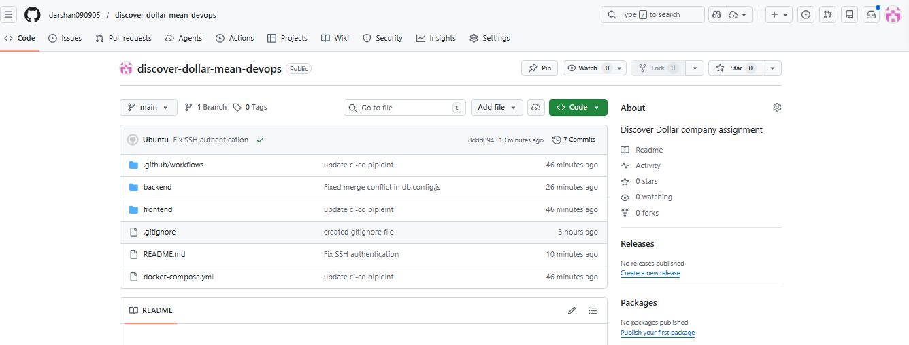
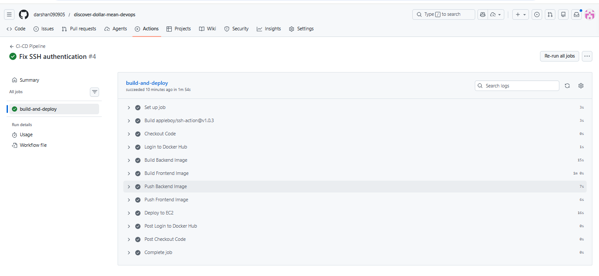
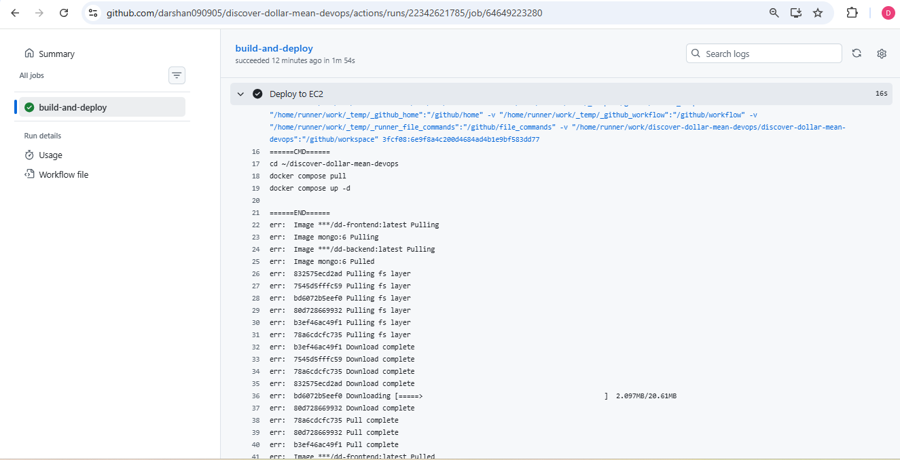
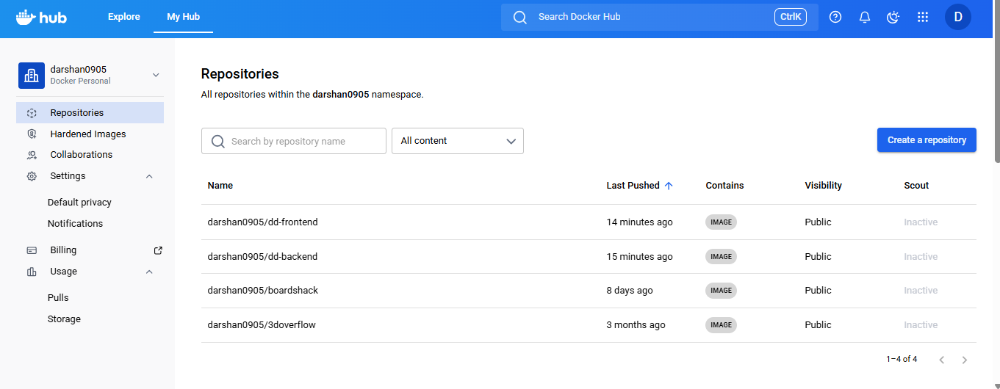
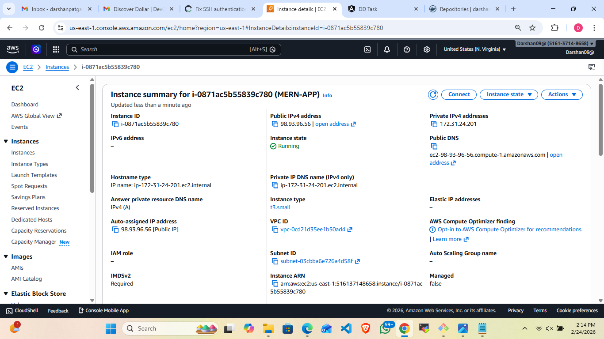
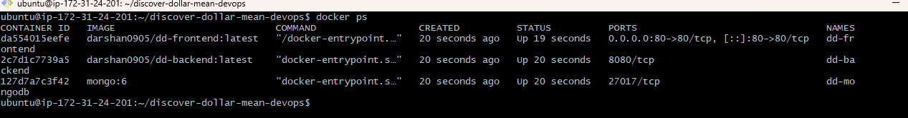
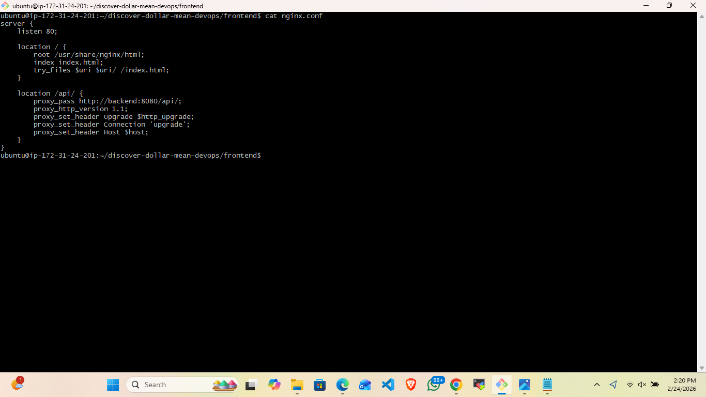
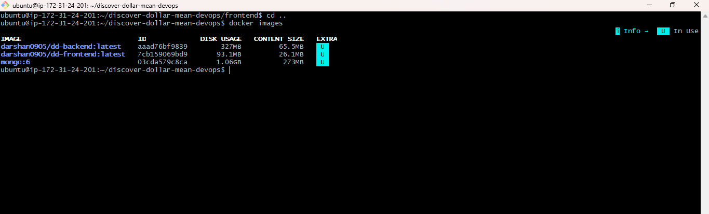

# Discover Dollar DevOps Assignment – MEAN Stack Deployment

## Project Overview

This project demonstrates the containerization, CI/CD automation, and cloud deployment of a full-stack MEAN (MongoDB, Express, Angular, Node.js) application.

The application is fully dockerized, deployed on AWS EC2, and integrated with GitHub Actions for automated CI/CD.

--------------------------------------------------

## Architecture

Browser
   |
   v
Nginx (Frontend Container)
   |
   v
Backend (Node.js / Express)
   |
   v
MongoDB (Docker Container)

CI/CD Flow:

GitHub Push
   |
   v
GitHub Actions
   |
   v
Build Docker Images
   |
   v
Push to Docker Hub
   |
   v
SSH into EC2
   |
   v
docker compose pull
   |
   v
docker compose up -d

--------------------------------------------------

## Technologies Used

- Angular 15 (Frontend)
- Node.js & Express (Backend)
- MongoDB
- Docker & Docker Compose
- Nginx (Reverse Proxy)
- AWS EC2 (Ubuntu t3.small, 20GB)
- Docker Hub
- GitHub Actions (CI/CD)

--------------------------------------------------

## Dockerization

Backend:
- Node 18 Alpine base image
- Production dependencies only
- Exposes port 8080

Frontend:
- Multi-stage build
- Angular production build
- Nginx used to serve static files
- Reverse proxy configured for /api

--------------------------------------------------

## Nginx Reverse Proxy Configuration

location /api/ {
    proxy_pass http://backend:8080/api/;
}

This ensures the entire application is accessible via port 80.

--------------------------------------------------

## Deployment Details

- AWS EC2 Ubuntu instance
- Instance Type: t3.small
- Storage: 20GB
- Elastic IP attached
- Docker Compose used for orchestration

Application URL:

http://98.93.96.56

--------------------------------------------------

## CI/CD Pipeline (GitHub Actions)

On every push to the main branch:

1. Checkout repository
2. Build backend Docker image
3. Build frontend Docker image
4. Push images to Docker Hub
5. SSH into EC2
6. Pull latest images
7. Restart containers automatically

Workflow file location:

.github/workflows/deploy.yml

--------------------------------------------------

## Docker Hub Repositories

- darshan0905/dd-backend
- darshan0905/dd-frontend

--------------------------------------------------

## Screenshots

### 1. GitHub Repository Structure

### 2. GitHub Actions Successful Run

### 3. Deploy Logs

### 4. Docker Hub Images

### 5. EC2 Instance Details

### 6. Running Containers

### 7. Application Workingi

### 8. Nginx Configuration

### 9. Docker Compose Configuration

--------------------------------------------------

## Features Implemented

- Full Dockerization
- Multi-stage frontend build
- MongoDB containerized
- Docker Compose orchestration
- Nginx reverse proxy
- Docker Hub image registry
- AWS EC2 deployment
- Fully automated CI/CD pipeline

--------------------------------------------------

## Author

Darshan Patgar
DevOps Internship Assignment Submission
